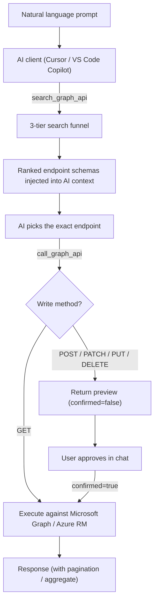
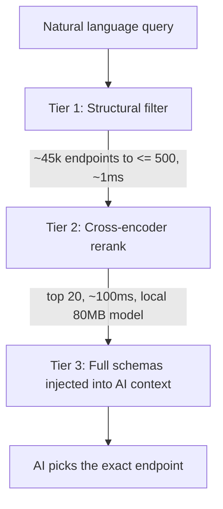

# GraphMind

[](https://github.com/askaresh/graphmind/actions/workflows/test.yml)
[](LICENSE)
[](https://www.python.org/downloads/)

**API-aware MCP server for Microsoft Graph — always fresh, never hallucinated.**

GraphMind solves the core problem with AI + Microsoft Graph: LLMs have a training
cutoff and will hallucinate endpoint paths for APIs released after training.
GraphMind maintains a local, always-fresh index of the entire Graph API and uses a
3-tier funnel to find the correct endpoint for any natural language query.

## Architecture

GraphMind sits between your AI client and Microsoft Graph. The AI never guesses
endpoint paths — it searches a local, always-fresh index first, then executes the
exact endpoint it found.



### The 3-tier search funnel



Search also applies **domain hints** (e.g. Cloud PC / snapshot queries auto-select
`api_version=beta` and narrow tags). Write calls require **user confirmation**
before execution.

## Prerequisites

- **Python 3.11+** and **git** on your PATH
- A **Microsoft Entra tenant** with an **app registration** (see [docs/entra_setup.md](docs/entra_setup.md))

## Quick Start

```bash
# 1. Install
pip install -e ".[dev]"

# 2. Configure — copy the example env, then fill in TENANT_ID, CLIENT_ID, AUTH_MODE
cp .env.example .env       # macOS / Linux
copy .env.example .env     # Windows (PowerShell / cmd)

# 3. Verify (auto-clones msgraph-metadata on first run)
graphmind stats

# 4. Start MCP server
graphmind serve
```

The spec repo is cloned to `./msgraph-metadata` automatically when missing.
See [docs/spec_lifecycle.md](docs/spec_lifecycle.md) for the full lifecycle and
recommended CI workflow.

See [docs/entra_setup.md](docs/entra_setup.md) for Entra app registration and permissions.

### What to expect on first run

- **Cold start (~4–6 min):** the first tool call parses the full Graph OpenAPI spec
  (~45k endpoints) into an in-memory index. The MCP server responds to the handshake
  immediately and loads the index in the background; subsequent searches are instant
  until the process restarts. See
  [docs/spec_lifecycle.md](docs/spec_lifecycle.md#what-happens-at-runtime).
- **One-time model download (~80MB):** the cross-encoder reranker downloads on the
  first `search_graph_api` call, then is cached locally.

**Realistic time-to-first-query:** GraphMind itself is clone-and-go in ~3 minutes.
Because the one-time Entra app registration + admin consent and the cold-start parse
are unavoidable, plan for **~10–15 minutes** before your first live Graph call.

### Cursor MCP setup

This repo includes `.cursor/mcp.json`. Credentials stay in `.env` (not in MCP config):

```json
{
  "mcpServers": {
    "graphmind": {
      "command": "python",
      "args": ["-m", "graphmind.mcp.server"],
      "cwd": "${workspaceFolder}",
      "env": {
        "SPEC_REPO_PATH": "./msgraph-metadata",
        "AUTH_MODE": "interactive",
        "DEFAULT_API_VERSION": "v1.0"
      }
    }
  }
}
```

Enable GraphMind under **Cursor Settings → MCP**. The index loads in the background
on the first tool call (~4–6 minutes cold; instant once warm). See
[docs/spec_lifecycle.md](docs/spec_lifecycle.md#what-happens-at-runtime).

Agent behaviour for Graph queries is defined in `.cursor/rules/graphmind-mcp.mdc`.

### VS Code (GitHub Copilot) MCP setup

This repo includes `.vscode/mcp.json`, which VS Code picks up automatically when you
open the folder. It uses VS Code's MCP schema (`servers` + `"type": "stdio"`).
Credentials stay in `.env` (not in the MCP config):

```json
{
  "servers": {
    "graphmind": {
      "type": "stdio",
      "command": "python",
      "args": ["-m", "graphmind.mcp.server"],
      "cwd": "${workspaceFolder}",
      "env": {
        "SPEC_REPO_PATH": "./msgraph-metadata",
        "AUTH_MODE": "interactive",
        "DEFAULT_API_VERSION": "v1.0"
      }
    }
  }
}
```

Requires **GitHub Copilot agent mode** (`Chat: Agent` view). Open the Chat view, switch
to **Agent**, then **Start** the `graphmind` server from the MCP tools picker. As with
Cursor, the index loads in the background on the first tool call (~4–6 minutes cold).

Any other MCP-capable client works too — point it at the stdio command
`python -m graphmind.mcp.server` run from the repo root.

## MCP tools

Always use this workflow for tenant / Graph questions:

1. **`search_graph_api`** — natural language query; returns ranked endpoint schemas
2. **`get_endpoint_schema`** — full parameters for a chosen path (optional)
3. **`call_graph_api`** — execute the call against Graph or Azure RM

Additional tool:

- **`get_changelog`** — recently decommissioned endpoints from the spec diff pipeline

### `call_graph_api` options

| Parameter | Default | Purpose |
|---|---|---|
| `paginate` | `false` | Follow `@odata.nextLink` for large GET collections |
| `aggregate` | `true` | With `paginate`, return `{ total, sample }` instead of full JSON |
| `max_pages` | `50` | Page limit when paginating |
| `sample_size` | `10` | Rows in aggregate sample |
| `confirmed` | `false` | **Required for writes** — see below |

**Write confirmation:** POST, PATCH, PUT, and DELETE calls return a preview on the
first call (`confirmed: false`). Re-call with the same parameters and
`confirmed: true` only after the user explicitly approves. Set
`GRAPHMIND_REQUIRE_WRITE_CONFIRMATION=false` to skip (e.g. automation scripts).

**404 handling:** Failed calls suggest related endpoints from the local index when possible.

### Example queries

| Question | Approach |
|---|---|
| How many users? | search → `GET /users/$count` or `GET /users` with `paginate=true, aggregate=true` |
| List Cloud PCs | search → `GET /deviceManagement/virtualEndpoint/cloudPCs` |
| Cloud PC restore points | search (beta) → resolve Cloud PC id → `GET .../cloudPCs/{id}/retrieveSnapshots()` |
| Reboot a Cloud PC | search → POST `.../reboot` → preview → user confirms → `confirmed: true` |

Many Windows 365 / Cloud PC APIs are **beta-only**. GraphMind auto-selects beta for
Cloud PC and snapshot queries.

## CLI

| Command | Description |
|---|---|
| `graphmind serve` | Start MCP server |
| `graphmind bootstrap` | Clone msgraph-metadata (also runs automatically) |
| `graphmind refresh` | Pull latest spec + diff |
| `graphmind scheduler` | Run daily/weekly spec refresh scheduler |
| `graphmind stats` | Index statistics |
| `graphmind search "query"` | Terminal search (debug; no domain hints) |

## Helper scripts

Optional dev helpers under [`scripts/`](scripts/) bypass MCP (no write confirmation gate).
See [`scripts/README.md`](scripts/README.md) for details.

| Script | Purpose |
|---|---|
| `count_users.py` | Entra user count |
| `count_cloud_pcs.py` / `list_cloud_pcs.py` | Cloud PC inventory |
| `cloudpc_specs.py` | Cloud PC SKU details |

Tenant-specific scripts belong in `scripts/local/` (gitignored, not on GitHub).

Run from repo root: `python scripts/count_users.py`

## Configuration

See `.env.example` for the full list. Key variables:

| Variable | Default | Description |
|---|---|---|
| `DEFAULT_API_VERSION` | `v1.0` | Default API version for search and calls |
| `SPEC_AUTO_CLONE` | `true` | Auto-clone msgraph-metadata on first run |
| `STRUCTURAL_FILTER_CEILING` | `500` | Max candidates before reranking |
| `RERANKER_TOP_K` | `20` | Endpoints returned after rerank |
| `GRAPHMIND_READ_ONLY` | `false` | Block all write methods via MCP |
| `GRAPHMIND_REQUIRE_WRITE_CONFIRMATION` | `true` | Preview before POST/PATCH/PUT/DELETE |
| `GRAPHMIND_MAX_PAGES` | `50` | Default page limit for pagination |
| `GRAPHMIND_MAX_RESPONSE_CHARS` | `8000` | Truncate large MCP responses |
| `TOKEN_CACHE_PATH` | `./.graphmind_token_cache.json` | Persisted MSAL token cache |

After changing Entra permissions, delete the token cache and retry.

## GitHub Actions

- **`.github/workflows/test.yml`** — runs on push/PR: compileall + pytest
- **`.github/workflows/refresh.yml`** — daily at 02:00 AEST, pulls latest
  `msgraph-metadata`, diffs against the stored manifest, and commits changes.
  No auth secrets required for the spec refresh job.

## Development

```bash
pip install -e ".[dev]"
python -m pytest tests/ -v
python -m compileall graphmind
```
