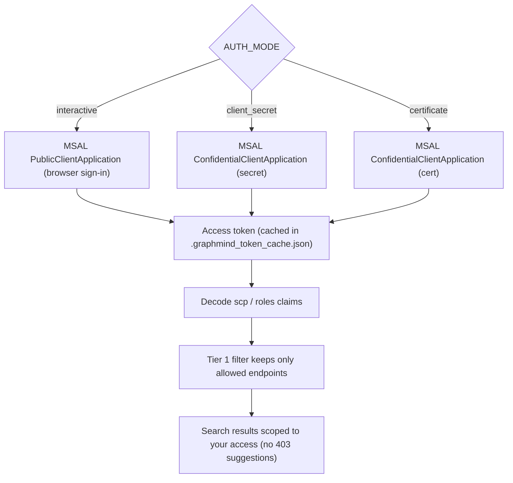

# Entra App Registration — Step-by-Step

This guide walks through registering an Entra application for GraphMind
and configuring the right permissions for your use case.

---

## 1. Create the App Registration

1. Go to **portal.azure.com** → **Microsoft Entra ID** → **App registrations**
2. Click **New registration**
3. Fill in:
   - **Name:** `GraphMind` (or any name you prefer)
   - **Supported account types:** `Accounts in this organizational directory only`
   - **Redirect URI:** leave blank (not needed for app-only or interactive flows)
4. Click **Register**
5. Copy the following from the **Overview** page into your `.env`:
   - **Application (client) ID** → `CLIENT_ID`
   - **Directory (tenant) ID** → `TENANT_ID`

---

## 2. Choose Your Authentication Mode

GraphMind supports three modes. Pick the one that fits your environment.

### Mode A — Interactive (Recommended for Dev/Testing)

Best for: local development, personal tenant testing

No secret needed. GraphMind opens a browser popup for sign-in.

```env
AUTH_MODE=interactive
CLIENT_ID=<your-client-id>
TENANT_ID=<your-tenant-id>
```

In the app registration → **Authentication** → Add platform → **Mobile and desktop**
→ tick `https://login.microsoftonline.com/common/oauth2/nativeclient`

---

### Mode B — Client Secret (Recommended for GitHub Actions / Servers)

Best for: CI/CD pipelines, headless servers, GitHub Actions

1. In app registration → **Certificates & secrets** → **New client secret**
2. Set expiry (12 months recommended — set a calendar reminder)
3. Copy the **Value** immediately (shown only once)

```env
AUTH_MODE=client_secret
CLIENT_ID=<your-client-id>
TENANT_ID=<your-tenant-id>
CLIENT_SECRET=<your-secret-value>
```

**For GitHub Actions**, add these as repository secrets:
- `Settings` → `Secrets and variables` → `Actions` → `New repository secret`
- Add: `TENANT_ID`, `CLIENT_ID`, `CLIENT_SECRET`

Then reference in your workflow:
```yaml
env:
  TENANT_ID: ${{ secrets.TENANT_ID }}
  CLIENT_ID: ${{ secrets.CLIENT_ID }}
  CLIENT_SECRET: ${{ secrets.CLIENT_SECRET }}
```

---

### Mode C — Certificate (Production Recommended)

Best for: production environments, higher security posture

1. Generate a self-signed cert:
   ```bash
   openssl req -x509 -newkey rsa:2048 -keyout key.pem -out cert.pem -days 365 -nodes
   cat key.pem cert.pem > graphmind.pem   # combined PEM for MSAL
   ```
2. Upload `cert.pem` (public key only) to app registration → **Certificates & secrets** → **Upload certificate**
3. Store `graphmind.pem` (private key) securely — never commit to git

```env
AUTH_MODE=certificate
CLIENT_ID=<your-client-id>
TENANT_ID=<your-tenant-id>
CERT_PATH=/secure/path/to/graphmind.pem
```

---

## 3. Grant API Permissions

In app registration → **API permissions** → **Add a permission** → **Microsoft Graph**

Choose **Application permissions** (for app-only / CI) or
**Delegated permissions** (for interactive mode).

### Starter Permission Set (read-only, safe for testing)

| Permission | Type | What it enables |
|---|---|---|
| `User.Read.All` | Application | Read all users |
| `Group.Read.All` | Application | Read all groups |
| `GroupMember.Read.All` | Application | Read group membership |
| `Directory.Read.All` | Application | Read directory objects |
| `Policy.Read.All` | Application | Read conditional access, auth policies |
| `DeviceManagementManagedDevices.Read.All` | Application | Read Intune devices |
| `DeviceManagementConfiguration.Read.All` | Application | Read Intune config profiles |

### Windows 365 / Cloud PC (add when querying Cloud PCs)

| Permission | Type | What it enables |
|---|---|---|
| `CloudPC.Read.All` | Application | List Cloud PCs, read restore points |
| `CloudPC.ReadWrite.All` | Application | Reboot, restore, resize, reprovision |

Snapshot restore points use the beta function
`GET .../cloudPCs/{id}/retrieveSnapshots()` — not the tenant `/snapshots` collection.

### Extended Set (for write operations)

Add these only when you need to make changes:

| Permission | What it enables |
|---|---|
| `User.ReadWrite.All` | Create/update/delete users |
| `Group.ReadWrite.All` | Create/update/delete groups |
| `DeviceManagementManagedDevices.ReadWrite.All` | Intune device management |
| `RoleManagement.ReadWrite.Directory` | Entra role assignments |

### Grant Admin Consent

After adding permissions:
- Click **Grant admin consent for [your tenant]**
- Confirm → all permissions should show a green tick

> ⚠️ Admin consent is required for Application permissions.
> You need a **Global Administrator** or **Privileged Role Administrator** to grant this.

---

## 4. Verify the Setup

```bash
# Check GraphMind can authenticate and load the index
graphmind stats

# Run a quick search (no write permissions needed)
graphmind search "list all users in the tenant"

# If auth works and results appear, you're ready to start the MCP server
graphmind serve
```

---

## 5. Permission-Aware Filtering

GraphMind's Tier 1 filter automatically reads your app's granted permissions
from the JWT token and only returns endpoints your app is allowed to call.



This means:
- No more 403 errors from the AI suggesting an endpoint you can't call
- Search results are always scoped to your actual access level
- After adding new permissions in Entra, restart GraphMind or delete
  `.graphmind_token_cache.json` so MSAL acquires a fresh token with updated claims

---

## 6. Write Confirmation (MCP)

Even with write permissions granted, GraphMind's MCP server requires **explicit user
confirmation** before POST, PATCH, PUT, or DELETE calls (reboot, delete, assign, etc.).

1. First `call_graph_api` call returns a preview (`confirmed: false`)
2. User approves in the chat
3. Agent re-calls with `confirmed: true`

Set `GRAPHMIND_REQUIRE_WRITE_CONFIRMATION=false` in `.env` to disable (not recommended
for interactive use). `GRAPHMIND_READ_ONLY=true` blocks all writes entirely.

Direct scripts under `scripts/` bypass this gate.

---

## 7. GitHub Actions

The daily spec refresh workflow (`.github/workflows/refresh.yml`) only pulls
public `msgraph-metadata` and diffs the local index — **no Entra secrets are
required** for that job.

If you add a separate workflow that calls Microsoft Graph from CI, add
`TENANT_ID`, `CLIENT_ID`, and `CLIENT_SECRET` as repository secrets under
**Settings → Secrets and variables → Actions**.
