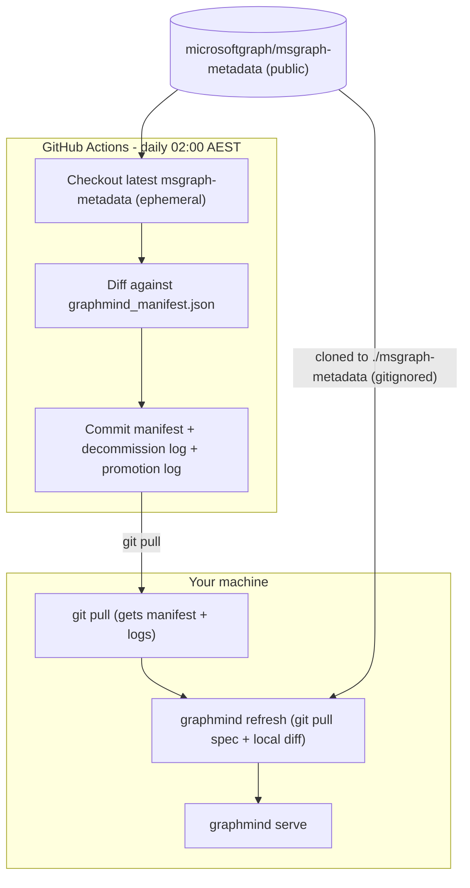
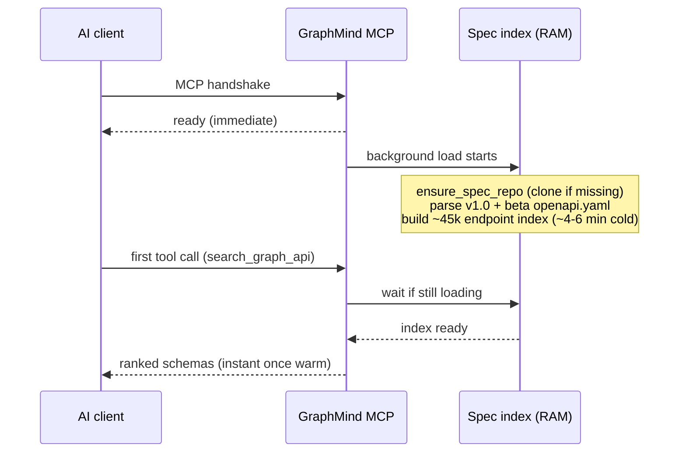

# Microsoft Graph Spec — Lifecycle & Workflow

GraphMind reads endpoint definitions from Microsoft's public
[msgraph-metadata](https://github.com/microsoftgraph/msgraph-metadata) repo.
This document describes where that spec lives and how to keep it in sync.

---

## What lives where

| Asset | Location | Committed to GraphMind git? |
|---|---|---|
| OpenAPI YAML (source of truth for search) | `./msgraph-metadata/` locally | No (gitignored) |
| Endpoint manifest (diff baseline) | `./graphmind_manifest.json` | Yes (updated by CI) |
| Decommission log | `./graphmind_decommission_log.jsonl` | Yes (updated by CI) |
| Promotion log (beta → v1.0) | `./graphmind_promotion_log.json` | Yes (updated by CI) |
| In-memory search index | RAM at `graphmind serve` startup | No |

> Note: `graphmind_manifest.json` and `graphmind_decommission_log.jsonl` are **created on
> the first `graphmind refresh` or CI refresh run** — they are not present in a fresh
> clone. The `get_changelog` MCP tool handles their absence gracefully and tells you to
> run `graphmind refresh`.

---

## Recommended workflow: CI owns the manifest

Use GitHub Actions as the **single source of truth** for change tracking.
Your machine only needs the OpenAPI files for runtime search.



### Daily (automatic)

1. **GitHub Actions** (`refresh.yml`) runs at 02:00 AEST
2. Checks out latest `msgraph-metadata` (ephemeral — not stored in your repo)
3. Diffs against `graphmind_manifest.json`
4. Commits updated manifest, decommission log, and promotion log

### On your machine (when you start work)

```bash
git pull                          # get latest manifest + logs from CI
graphmind refresh                 # git pull inside ./msgraph-metadata + local diff
graphmind serve                   # start MCP
```

First run auto-clones the spec if missing (`SPEC_AUTO_CLONE=true` by default).

### Manual bootstrap (optional)

```bash
graphmind bootstrap               # clone msgraph-metadata explicitly
# or
git clone https://github.com/microsoftgraph/msgraph-metadata ./msgraph-metadata
```

---

## Local-only workflow (no CI)

If you are not using GitHub Actions:

```bash
graphmind bootstrap               # one-time clone
graphmind refresh                 # pull latest spec + update local manifest
graphmind scheduler               # optional: daily refresh at 02:00
graphmind serve
```

Your local `graphmind_manifest.json` is the diff baseline — back it up or commit it yourself.

---

## Environment variables

| Variable | Default | Purpose |
|---|---|---|
| `SPEC_REPO_PATH` | `./msgraph-metadata` | Where the spec clone lives |
| `SPEC_REPO_URL` | `https://github.com/microsoftgraph/msgraph-metadata.git` | Clone URL |
| `SPEC_AUTO_CLONE` | `true` | Auto-clone on first `serve` / `stats` / `search` |
| `SPEC_REFRESH_SCHEDULE` | `daily` | Scheduler frequency for `graphmind scheduler` |

---

## What happens at runtime



The MCP server answers the handshake immediately and loads the index in a background
task, so the client does not time out during the cold-start parse.

**Cold start:** Parsing the full OpenAPI YAML takes **~4–6 minutes** on first load
in a new Python process. The MCP server starts immediately and loads the index in
the background so Cursor does not time out during handshake. Once warm, searches are
fast until the process restarts.

Live network calls only happen for `call_graph_api` (actual Graph requests) and
`graphmind refresh` (git pull of the spec repo).
